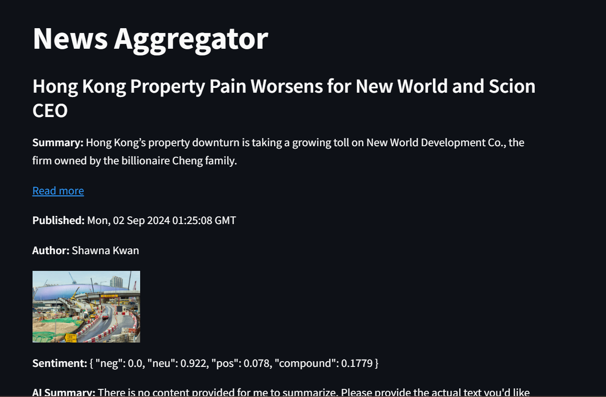

# NewsAggrigator-AIthon
Financial News Aggregator that uses RSS feeds to source news articles from different websites. It uses Sentiment analysis to Recommend and categorize news. 



## Overview

This project is a financial news aggregator that collects articles from Bloomberg and analyzes their sentiment using VADER. It also uses Ollama's LLaMA 3.1 model to generate AI summaries for the articles.

## Features

- Fetches financial news articles from Bloomberg RSS feeds.
- Performs sentiment analysis on article summaries using VADER.
- Generates AI summaries of article content using Ollama's LLaMA 3.1 model.

## Technologies Used

- **Python**: Backend logic and data processing.
- **Flask**: Web framework for the backend server.
- **Feedparser**: For parsing RSS feeds.
- **NLTK VADER**: For sentiment analysis.
- **Ollama (LLaMA 3.1)**: For generating AI summaries.
- **HTML/CSS/JavaScript**: For the frontend.

## Setup and Installation

1. **Clone the repository**:
    ```bash
    git clone https://github.com/your-username/financial-news-aggregator.git
    ```
   
2. **Navigate into the directory**:
    ```bash
    cd financial-news-aggregator
    ```

3. **Install the required dependencies**:
    ```bash
    pip install -r requirements.txt
    ```
    Ensure you have `ollama` installed correctly:
    ```bash
    pip install ollama
    ```

4. **Run the Flask server**:
    ```bash
    python app.py
    ```

5. **Access the application**:
    - Open your browser and go to `http://127.0.0.1:5000/api/news` to fetch live news.

## Usage

- The application automatically fetches articles, performs sentiment analysis, and generates AI summaries.
- Use a tool like `curl` or your browser to access the `/api/news` endpoint to see the output.

## Issues and Debugging

If you encounter issues with Ollama or the Flask server:
- Ensure your server and endpoints are correctly configured.
- Check if all dependencies are installed and compatible.

## Contributing

Feel free to submit issues, fork the repo, and make pull requests. Contributions are welcome!

## License

This project is licensed under the MIT License - see the LICENSE file for details.

